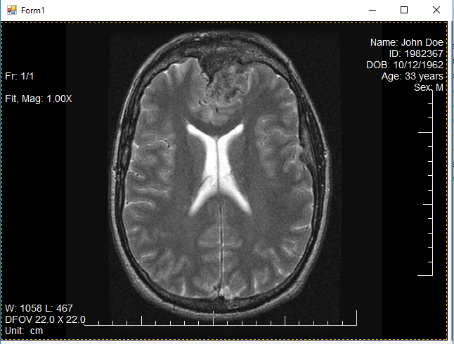

# LTMedicalDicomViewer
.NET Core Winforms Medical Dicom Viewer using LEADTOOLS

The following project utilizes the LEADTOOLS Dicom libraries to enable users open and display medical Dicom files. More information an be found at the links below:

Leadtools Dicom SDK:
https://www.leadtools.com/sdk/medical/dicom

#Note: must have LEADTOOLS libraries to run

